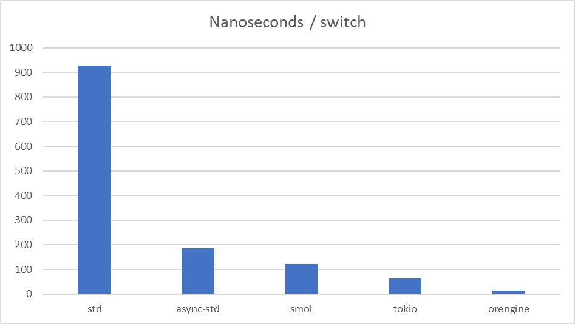
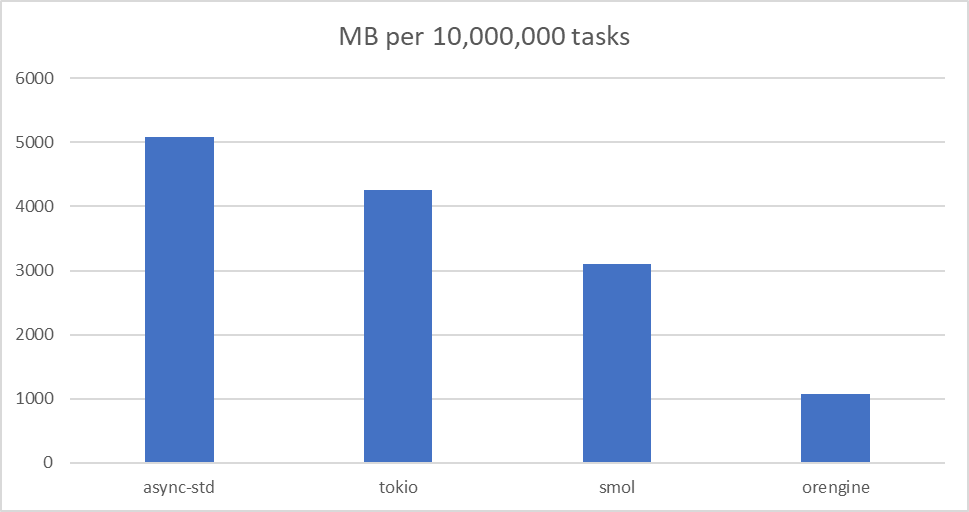

# This directory contains the results of the cpu\_bound benchmarks

## Create task and yield

This benchmark measures the overhead of creating a task, returning from it and yielding. This shows well how expensive asynchronous abstractions of the engine are.

This test has two options. In the first case, the tasks contain only one number and return it. In the second case, the tasks contain a buffer that contains 9000 bytes on the stack and return its length. **Less is better**

**All**

**Favorites only**

## Task switch

This benchmark measures the overhead of switching between tasks. **Less is better**

## Mutex lock and unlock

This benchmark measures the overhead of locking and unlocking a mutex. This test shows that an asynchronous Mutex can run just as fast as a synchronous one. So don't be afraid to use `orengine::sync::Mutex` in your tasks! **Less is better**

## Memory usage per task

This benchmark measures the memory usage per task. This was measured by creating 10,000,000 sleeping tasks, so the result cannot be less than 16 bytes (required for `std::time::Instant`). In fact, it cannot be less than 32 bytes, since you need to keep at least a `wide pointer` to the `Future` or even the `Layout`. **Less is better**

**All**

**Favorites only**

